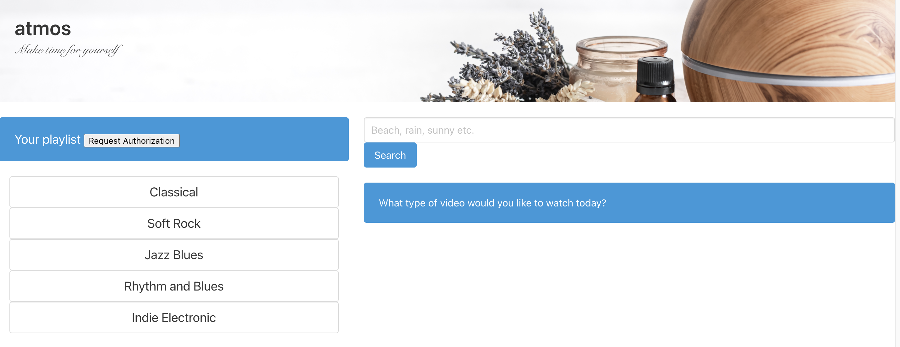

# atmos-project
Api project

Atmos allows a user to choose a genre of music that they are in the mood for along with searching visuals they would like to see. The problem we are trying to solve is to allow the user to create a personalized experience without video editing knowledge or without requiring the use of multiple apps/browsers to achieve the same goal. 

We used the Spotify and Youtube APIS to retrieve the playlist/video ID information and we used the CSS library Bulma for the styling.

## Link for the repo

[homework](https://chergul.github.io/atmos-project/)

## Screenshot for the application

